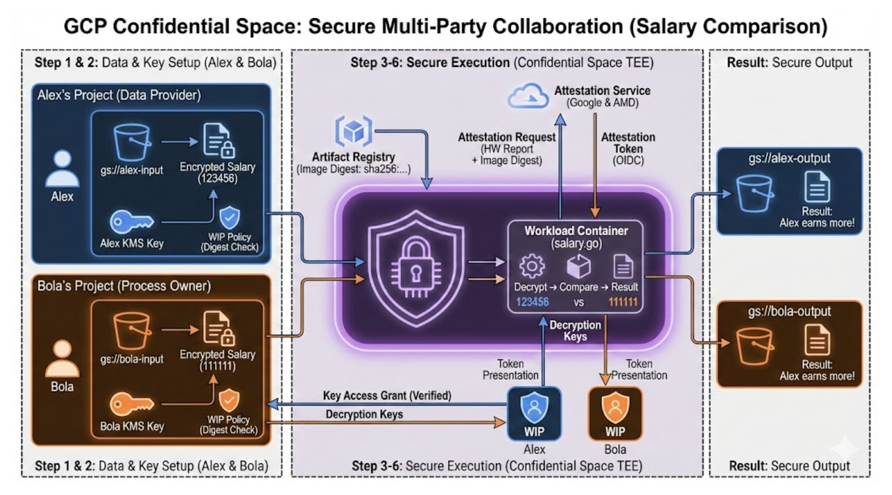

# GCP Confidential Space 튜토리얼

## 시나리오

연봉 협상을 앞둔 Alex와 Bola는 서로의 정확한 연봉은 공개하지 않은 채, "누가 더 많은 연봉을 받는지"만 확인하고 싶어 합니다. 이를 위해 메모리 영역까지 암호화되는 '디지털 밀실(Confidential VM)'을 구축하고, 해당 환경 내부에서만 데이터를 비교한 뒤 결과값만 외부로 전출하는 해결책을 사용합니다.

## 전체 아키텍처 (Big Picture)



이 아키텍처는 "데이터는 암호화된 상태로 전달되며, 오직 검증된(Attested) 코드만이 신뢰 실행 환경(TEE) 내부에서 이를 복호화할 수 있다"는 원칙을 기반으로 합니다. 시스템의 3가지 핵심 요소는 다음과 같습니다.

1.  **데이터 (File):** 암호화되어 안전하게 보호되는 상태입니다. (좌측의 Encrypted Salary 및 KMS Key)
2.  **Confidential VM:** 내부가 외부로부터 완전히 격리된 보호 환경입니다. (중앙의 Confidential Space TEE 영역)
3.  **증명 (Attestation):** 프로그램의 지문(Image Digest)이 일치하는 경우에만 밀실에 접근할 수 있는 열쇠가 부여됩니다. (중앙 상단의 Attestation Request 및 Token)

### 다이어그램 흐름 상세 설명

전체 흐름은 준비(좌측), 실행(중앙), 결과(우측)의 3단계로 구성됩니다.

- **Step 1 & 2: 데이터 및 키 설정 (Data & Key Setup)**
  - Alex와 Bola는 완전히 분리된 별도의 프로젝트를 사용하며, 서로의 영역에 접근할 수 없습니다.
  - 각자의 연봉 데이터를 KMS 키로 암호화하여 버킷(gs://...)에 저장합니다.
  - 워크로드 ID 풀(WIP) 정책을 통해 "특정 지문(Digest)을 가진 프로그램에만 키 사용을 허용하겠다"고 설정합니다.

- **Step 3-6: 안전한 실행 환경에서의 구동 (Secure Execution)**
  - **TEE (Trusted Execution Environment):** 하드웨어적으로 보호되는 메모리 공간으로, 구글 관리자도 접근이 불가능합니다.
  - **Attestation Service:** VM이 실행되면 하드웨어(AMD)와 구글이 협력하여 해당 VM의 안전성과 실행 코드의 지문을 증명하는 신분증(Attestation Token/OIDC)을 발급합니다.
  - **WIP (검문소):** 워크로드는 발급받은 신분증을 제시하여 Alex와 Bola의 WIP에 접근을 요청합니다.
  - **키 접근 (Key Access):** 신분증이 확인되면 복호화 키(Decryption Keys)를 획득합니다.
  - **메모리 내 처리 (In-Memory Processing):** 암호화된 데이터는 오직 이 밀실 안에서만 일시적으로 복호화되어 비교 연산에 사용되며, 연산 직후 즉시 파기됩니다.

- **결과 도출 (Secure Output)**
  - 구체적인 연봉 수치는 외부로 유출되지 않습니다.
  - "Alex의 연봉이 더 높다"와 같은 비교 결과만이 각자의 버킷에 저장됩니다.

---

## Step 1: Alex (데이터 제공자) 환경 설정

### 개념: 데이터 주권 확보
Alex는 데이터를 클라우드에 업로드하지만, 서비스 제공자인 구글조차 그 내용을 확인할 수 없도록 KMS를 통해 암호화합니다. 현재는 Alex가 소유자로서 제어권을 갖지만, 최종적으로는 '검증된 VM'만이 이 데이터를 열어볼 수 있도록 설정할 것입니다.

### 1.1 환경 변수 설정
프로젝트 ID와 리소스 이름을 변수로 지정하여 설정을 진행합니다.

```bash
# [변경 필수] Alex의 프로젝트 ID
export ALEX_PROJECT_ID="your-alex-project-id"
# 리소스 이름 변수
export ALEX_KEYRING_NAME="alex-keyring"
export ALEX_KEY_NAME="alex-key"
export ALEX_POOL_NAME="alex-pool"
export ALEX_INPUT_BUCKET_NAME="${ALEX_PROJECT_ID}-input"
export ALEX_OUTPUT_BUCKET_NAME="${ALEX_PROJECT_ID}-output"
export ALEX_SALARY_FILE="alex_encrypted_salary"
```

### 1.2 프로젝트 준비 및 KMS 생성
KMS(Key Management Service)를 사용하여 데이터 암호화 및 복호화에 필요한 키를 관리합니다.

```bash
# 1. 프로젝트 생성 및 API 활성화
gcloud projects create $ALEX_PROJECT_ID
gcloud config set project $ALEX_PROJECT_ID
gcloud services enable artifactregistry.googleapis.com cloudkms.googleapis.com iamcredentials.googleapis.com

# 2. 키링 및 키 생성
gcloud kms keyrings create $ALEX_KEYRING_NAME --location=global
gcloud kms keys create $ALEX_KEY_NAME --location=global --keyring=$ALEX_KEYRING_NAME --purpose=encryption

# 3. 데이터 암호화를 위한 본인 권한 부여
gcloud kms keys add-iam-policy-binding "projects/$ALEX_PROJECT_ID/locations/global/keyRings/$ALEX_KEYRING_NAME/cryptoKeys/$ALEX_KEY_NAME" \
    --member=user:$(gcloud config get-value account) \
    --role=roles/cloudkms.cryptoKeyEncrypter
```

### 1.3 데이터 암호화 및 업로드
연봉 데이터(123456)를 암호화하여 버킷에 업로드합니다. 암호화된 파일은 해당 KMS 키 없이는 내용을 확인할 수 없습니다.

```bash
# 버킷 생성
gcloud storage buckets create gs://$ALEX_INPUT_BUCKET_NAME gs://$ALEX_OUTPUT_BUCKET_NAME

echo 123456 > alex_salary.txt

# 평문을 암호문으로 변환
gcloud kms encrypt \
    --ciphertext-file=$ALEX_SALARY_FILE \
    --plaintext-file=alex_salary.txt \
    --key="projects/$ALEX_PROJECT_ID/locations/global/keyRings/$ALEX_KEYRING_NAME/cryptoKeys/$ALEX_KEY_NAME"

# 암호화 여부 확인
hexdump $ALEX_SALARY_FILE

# 업로드
gcloud storage cp $ALEX_SALARY_FILE gs://$ALEX_INPUT_BUCKET_NAME
```

### 1.4 워크로드 ID 풀(WIP) 생성
VM이 키 사용을 요청할 때 신원 검증을 수행할 워크로드 ID 풀을 생성합니다.

```bash
gcloud iam workload-identity-pools create $ALEX_POOL_NAME --location=global
```

---

## Step 2: Bola (운영자) 환경 설정

### 개념: 제로 트러스트 (Zero Trust)
Bola는 시스템 운영자임에도 불구하고, 자신의 데이터가 오남용되지 않도록 제로 트러스트 원칙을 적용합니다. 본인이 생성한 VM이라 하더라도 허가되지 않은 데이터 접근은 불가능하도록 Alex와 동일한 보안 설정을 수행합니다.

### 2.1 환경 설정 및 데이터 암호화
Bola의 연봉 데이터(111111)를 암호화하며, 과정은 Alex의 설정과 동일합니다.

```bash
# [변경 필수] Bola의 프로젝트 ID
export BOLA_PROJECT_ID="your-bola-project-id"
export BOLA_KEYRING_NAME="bola-keyring"
export BOLA_KEY_NAME="bola-key"
export BOLA_POOL_NAME="bola-pool"
export BOLA_INPUT_BUCKET_NAME="${BOLA_PROJECT_ID}-input"
export BOLA_OUTPUT_BUCKET_NAME="${BOLA_PROJECT_ID}-output"
export BOLA_SALARY_FILE="bola_encrypted_salary"

gcloud projects create $BOLA_PROJECT_ID
gcloud config set project $BOLA_PROJECT_ID
gcloud services enable artifactregistry.googleapis.com cloudkms.googleapis.com iamcredentials.googleapis.com compute.googleapis.com confidentialcomputing.googleapis.com

gcloud kms keyrings create $BOLA_KEYRING_NAME --location=global
gcloud kms keys create $BOLA_KEY_NAME --location=global --keyring=$BOLA_KEYRING_NAME --purpose=encryption

gcloud kms keys add-iam-policy-binding "projects/$BOLA_PROJECT_ID/locations/global/keyRings/$BOLA_KEYRING_NAME/cryptoKeys/$BOLA_KEY_NAME" \
    --member=user:$(gcloud config get-value account) \
    --role=roles/cloudkms.cryptoKeyEncrypter

gcloud storage buckets create gs://$BOLA_INPUT_BUCKET_NAME gs://$BOLA_OUTPUT_BUCKET_NAME
echo 111111 > bola_salary.txt

gcloud kms encrypt \
    --ciphertext-file=$BOLA_SALARY_FILE \
    --plaintext-file=bola_salary.txt \
    --key="projects/$BOLA_PROJECT_ID/locations/global/keyRings/$BOLA_KEYRING_NAME/cryptoKeys/$BOLA_KEY_NAME"

gcloud storage cp $BOLA_SALARY_FILE gs://$BOLA_INPUT_BUCKET_NAME
gcloud iam workload-identity-pools create $BOLA_POOL_NAME --location=global
```

---

## Step 3: 워크로드 서비스 계정 설정

워크로드(VM)가 실행될 때 사용할 서비스 계정을 생성하고 필요한 권한을 부여합니다.

```bash
export WORKLOAD_SERVICE_ACCOUNT_NAME="workload-sa"

# 서비스 계정 생성
gcloud iam service-accounts create $WORKLOAD_SERVICE_ACCOUNT_NAME

# 이미지 접근 및 데이터 읽기/쓰기 권한 부여
gcloud projects add-iam-policy-binding $ALEX_PROJECT_ID \
    --member="serviceAccount:$WORKLOAD_SERVICE_ACCOUNT_NAME@$BOLA_PROJECT_ID.iam.gserviceaccount.com" \
    --role="roles/storage.objectAdmin"

gcloud projects add-iam-policy-binding $BOLA_PROJECT_ID \
    --member="serviceAccount:$WORKLOAD_SERVICE_ACCOUNT_NAME@$BOLA_PROJECT_ID.iam.gserviceaccount.com" \
    --role="roles/storage.objectAdmin"
```

---

## Step 4: 워크로드(Go 프로그램) 작성 및 배포

### 4.1 연봉 비교 프로그램 (salary.go)
Confidential Space 내부에서 실행될 프로그램은 암호화된 데이터를 가져와 복호화한 뒤 비교 작업을 수행합니다.

```go
// salary.go 요약:
// 1. Alex와 Bola의 버킷에서 암호화된 연봉 파일을 다운로드합니다.
// 2. 각자의 KMS 키와 WIP를 사용하여 데이터를 복호화합니다.
// 3. 복호화된 수치를 비교합니다.
// 4. 결과 메시지를 생성하여 양측의 출력 버킷에 저장합니다.
```

### 4.2 Dockerfile 작성 및 이미지 빌드
Confidential Space에서 실행 가능한 컨테이너 이미지를 생성합니다. 보안을 위해 환경 변수 재정의 허용 정책(LABEL)을 포함해야 합니다.

```bash
# Dockerfile 작성 (생략)
# 빌드 및 푸시
export REPOSITORY_NAME="salary-repo"
export WORKLOAD_CONTAINER_NAME="salary-workload"

gcloud artifacts repositories create $REPOSITORY_NAME --repository-format=docker --location=us
gcloud auth configure-docker us-docker.pkg.dev

docker build -t "us-docker.pkg.dev/$ALEX_PROJECT_ID/$REPOSITORY_NAME/$WORKLOAD_CONTAINER_NAME:latest" .
docker push "us-docker.pkg.dev/$ALEX_PROJECT_ID/$REPOSITORY_NAME/$WORKLOAD_CONTAINER_NAME:latest"
```

---

## Step 5: 보안 정책 등록 (Image Digest 등록)

가장 핵심적인 단계로, KMS는 오직 변조되지 않은 특정 프로그램에만 데이터 접근을 허용합니다. 이를 위해 빌드된 이미지의 해시값(Digest)을 보안 정책에 등록합니다.

### 5.1 이미지 지문(Digest) 확인
```bash
export WORKLOAD_IMAGE_DIGEST=$(gcloud artifacts docker images list \
    us-docker.pkg.dev/$ALEX_PROJECT_ID/$REPOSITORY_NAME/$WORKLOAD_CONTAINER_NAME \
    --sort-by=~UPDATE_TIME --limit=1 --format="value(DIGEST)")
```

### 5.2 보안 정책 설정 (WIP & KMS)
"지문이 일치하고 Confidential Space 환경에서 구동되는 경우에만 키 사용을 허용한다"는 조건을 설정합니다.

```bash
# Alex의 설정 예시
gcloud iam workload-identity-pools providers create-oidc attestation-verifier \
    --location="global" --workload-identity-pool=$ALEX_POOL_NAME \
    --issuer-uri="https://confidentialcomputing.googleapis.com/" \
    --allowed-audiences="https://sts.googleapis.com" \
    --attribute-mapping="google.subject=\"gcpcs::\"+assertion.submods.container.image_digest+\"::\"+assertion.submods.gce.project_number+\"::\"+assertion.submods.gce.instance_id, attribute.image_digest=assertion.submods.container.image_digest" \
    --attribute-condition="assertion.swname == 'CONFIDENTIAL_SPACE'"

gcloud kms keys add-iam-policy-binding \
    "projects/$ALEX_PROJECT_ID/locations/global/keyRings/$ALEX_KEYRING_NAME/cryptoKeys/$ALEX_KEY_NAME" \
    --member="principalSet://iam.googleapis.com/projects/$ALEX_PROJECT_NUMBER/locations/global/workloadIdentityPools/$ALEX_POOL_NAME/attribute.image_digest/$WORKLOAD_IMAGE_DIGEST" \
    --role=roles/cloudkms.cryptoKeyDecrypter
```

---

## Step 6: 워크로드 실행 및 결과 확인

### 6.1 VM 실행
AMD SEV 기술이 적용된 Confidential VM을 실행합니다. 이 환경에서는 하드웨어 수준에서 메모리가 암호화되어 구글조차 데이터를 훔쳐볼 수 없습니다.

```bash
export VM_NAME="salary-verifier-vm"

gcloud compute instances create $VM_NAME \
    --confidential-compute-type=SEV \
    --shielded-secure-boot \
    --scopes=cloud-platform \
    --zone=us-west1-b \
    --image-project=confidential-space-images \
    --image-family=confidential-space-debug \
    --metadata="^~^tee-image-reference=us-docker.pkg.dev/$ALEX_PROJECT_ID/$REPOSITORY_NAME/$WORKLOAD_CONTAINER_NAME:latest \
    ~tee-container-log-redirect=true \
    ~tee-env-COLLAB_1_NAME=Alex \
    ~tee-env-COLLAB_2_NAME=Bola \
    ..."
```

### 6.2 결과 확인
각자의 출력 버킷에 저장된 결과 파일을 확인하여 연봉 비교 결과를 확인합니다.

```bash
# 결과 확인 명령어 예시
gcloud storage cat gs://$ALEX_OUTPUT_BUCKET_NAME/comparison-result-* | tail -n 1
```

---

## 학습 완료
축하합니다! 이제 서로 신뢰하지 않는 당사자들이 데이터를 공개하지 않고도 안전한 신뢰 실행 환경(TEE)을 통해 데이터를 비교하고 결과를 얻는 시스템을 구축하는 방법을 습득하셨습니다.

## 참고 자료
- [Confidential Space 개요](https://cloud.google.com/confidential-computing/confidential-space/docs/confidential-space-overview)
- [첫 번째 Confidential Space 환경 만들기](https://cloud.google.com/confidential-computing/confidential-space/docs/create-your-first-confidential-space-environment)
